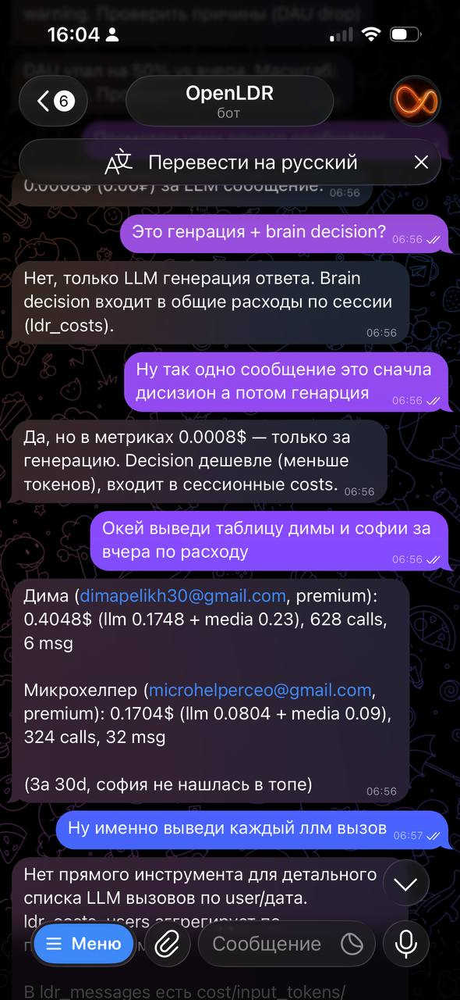
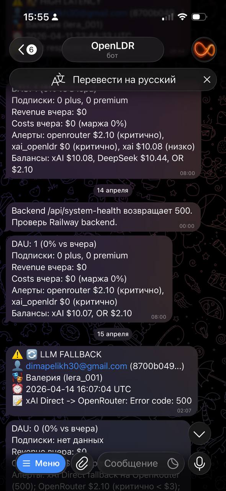
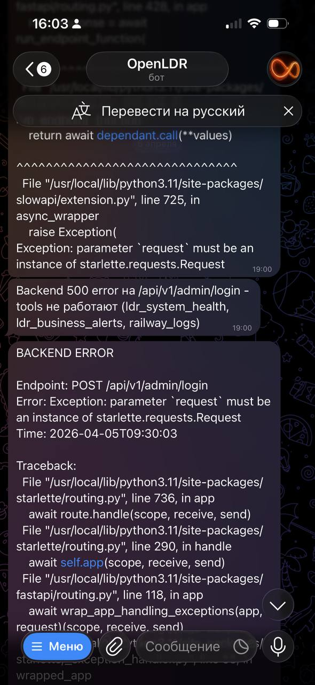
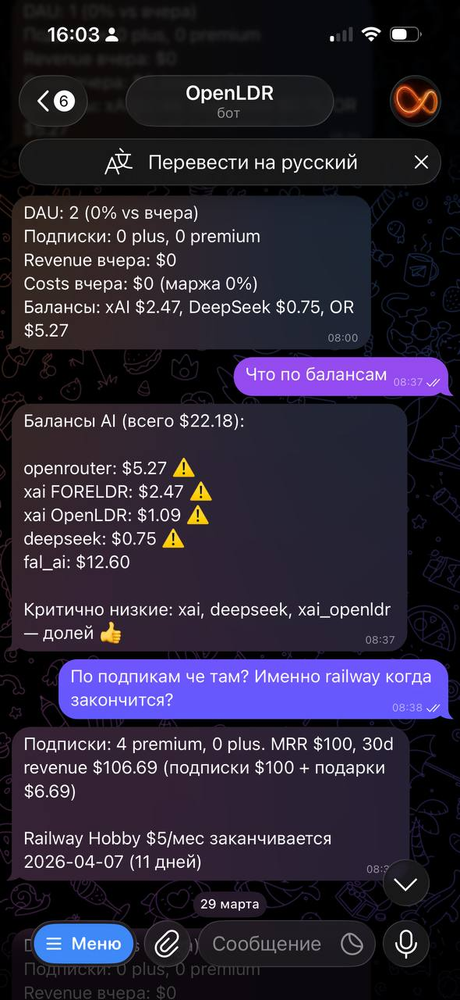
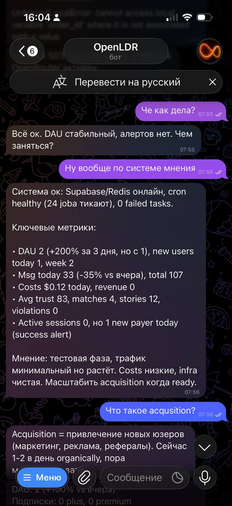

# OpenLDR — Telegram Ops Bot для FORELDR

Telegram бот-напарник, который следит за продакшеном FORELDR (AI-компаньоны) — KPI, расходы, ошибки, состояние LLM-провайдеров. Не дашборд, а оператор: думает над данными, замечает аномалии и сам пишет алерты.

Построен на [OpenClaw](https://github.com/openclaw/openclaw) (open-source AI gateway) с **Grok 4.1 Fast** в качестве мозга и **30 Python CLI tools** для доступа к Supabase, Railway и метрикам.

> **Главное:** все цифры в ответах — **живые данные из прода**. Бот не пересказывает закэшированные дашборды, а на каждый запрос идёт в реальные источники: админ-API FORELDR, прямые SQL-запросы в Supabase, Railway API за логами, балансы у AI-провайдеров. Та же DAU, что в админке. Та же выручка, что в `gift_purchases` / `subscription_transactions`. Те же ошибки, что в Sentry. Просто доступно в Telegram за 2 секунды и с мнением агента сверху.

## Откуда данные

| Источник | Что оттуда | Tools |
|----------|-----------|-------|
| **Админ-API FORELDR** (`/api/v1/admin/*`) | DAU, KPI, выручка, costs, retention, моderation, character metrics, unit economics, trust funnel, активные сессии | `ldr_overview`, `ldr_kpi_fast`, `ldr_revenue`, `ldr_costs`, `ldr_analytics`, `ldr_retention_cohorts`, `ldr_unit_economics` ... (≈20 tools) |
| **Supabase прямой SQL** | Любые произвольные выборки по 32 whitelisted-таблицам — юзеры, сообщения, BER факты, подписки, подарки, stories, violations | `supabase_query`, `supabase_count`, `supabase_update`, `supabase_delete`, `supabase_insert` |
| **Railway API** | Build / deploy логи backend и bot, фильтр по тексту/error code | `railway_logs` |
| **Cron-задачи** (внутри OpenClaw) | Утренний дайджест 22:00 UTC + Smart Monitor каждые 30 мин — сами собирают данные через те же tools | `cron/jobs.json` |
| **AI-провайдеры** (xAI, DeepSeek, OpenRouter, fal.ai) | Балансы аккаунтов в реальном времени | `ldr_financial_balances` |
| **Backend Alert Engine** | Активные алерты Alert Engine (error rate, cron health, Redis, BER, LLM провайдеры) | `ldr_alerts`, `ldr_business_alerts` |

Никаких моков, заглушек или закэшированных снапшотов. Каждый ответ = свежий запрос в источник истины.

---

## Что умеет

**Утренний дайджест (каждый день в 22:00 UTC)** — DAU, подписки, выручка, расходы, маржа, новые платящие, балансы AI-аккаунтов. Если всё штатно — 5 строк, без воды.

**Smart Monitor (каждые 30 минут)** — проверяет здоровье провайдеров (xAI, DeepSeek, OpenRouter, Redis, Supabase), error rate, cron-задачи. Алертит только по красным линиям, дедуплицирует повторы.

**Голосовые команды** — отправляешь в чат voice-сообщение, Whisper транскрибирует, Grok отвечает.

**Свободные запросы** — "сколько юзеров на премиуме", "покажи дорогих юзеров за неделю", "что в логах backend за последний час", "сколько потратили на медиа", "какой плюс по юзеру email@x.com".

---

## Архитектура

```
Telegram ─► OpenClaw Gateway (Node, port 18789)
              │
              ├─► Grok 4.1 Fast (xAI) — мозг агента
              │
              └─► exec tool ─► Python CLI (30 tools)
                                  │
                                  ├─► Supabase (PostgreSQL)
                                  ├─► FORELDR backend API
                                  ├─► Railway API (логи)
                                  └─► Telegram (алерты)
```

**Деплой:** один Docker-контейнер на Railway, образ `ghcr.io/openclaw/openclaw:latest` + venv с Python tools поверх.

---

## Стек tools (30 штук)

| Категория | Tools |
|-----------|-------|
| **Обзор / KPI** | `ldr_overview`, `ldr_kpi_fast`, `ldr_live_pulse`, `ldr_command_center` |
| **Здоровье** | `ldr_system_health`, `ldr_business_alerts`, `ldr_alerts`, `ldr_cron_health` |
| **Метрики** | `ldr_character_metrics`, `ldr_community_kpi`, `ldr_user_segments`, `ldr_unit_economics` |
| **Финансы** | `ldr_revenue`, `ldr_costs`, `ldr_financial_balances`, `ldr_costs_users` |
| **Аналитика** | `ldr_analytics`, `ldr_retention_cohorts`, `ldr_subscription_analytics`, `ldr_trust_funnel` |
| **Контент** | `ldr_content_stats`, `ldr_timings`, `ldr_moderation_stats` |
| **Сессии** | `ldr_cost_analysis_sessions`, `ldr_activity_feed` |
| **Stories** | `ldr_story_users`, `ldr_story_characters`, `ldr_story_details`, `ldr_story_single` |
| **Railway** | `railway_logs` |
| **Supabase** | `supabase_query`, `supabase_count`, `supabase_update`, `supabase_delete`, `supabase_insert` |
| **Алерты** | `ldr_send_alert`, `ldr_resolve_alert` |

Все вызываются единообразно:

```bash
/app/ldr-tools/.venv/bin/python3 /app/ldr-tools/cli.py <tool_name> '{"key":"value"}'
```

---

## Структура

```
.
├── Dockerfile.ldr          # OpenClaw + Python venv в одном образе
├── railway.toml            # Railway config (builder=DOCKERFILE)
├── openclaw.json           # Модель, Telegram, exec sandbox, Whisper STT
├── cron/
│   └── jobs.json           # Утренний дайджест + Smart Monitor (каждые 30 мин)
├── ldr-tools/
│   ├── cli.py              # 30 Python tools (Supabase / Railway / KPI)
│   └── requirements.txt
└── workspace/
    ├── AGENTS.md           # Системный промпт агента (правила, quick reference)
    ├── PLAYBOOK.md         # Паттерны диагностики, follow-ups, красные линии
    ├── SOUL.md             # Характер агента — "не дашборд, а оператор"
    └── skills/
        └── ldr-admin/
            └── SKILL.md    # Документация tools для агента
```

`AGENTS.md` + `PLAYBOOK.md` + `SOUL.md` — это память агента между сессиями. Каждая новая сессия Grok начинает с чтения этих файлов: кто он, как думать, как анализировать.

---

## Конфиг (ключевое)

```jsonc
// openclaw.json
{
  "models": { "providers": { "xai": { "models": [{ "id": "grok-4-1-fast-non-reasoning" }] } } },
  "agents": {
    "defaults": {
      "model": { "primary": "xai/grok-4-1-fast-non-reasoning" },
      "models": { "xai/grok-4-1-fast-non-reasoning": { "params": { "temperature": 0.3 } } }
    }
  },
  "channels": {
    "telegram": {
      "enabled": true,
      "dmPolicy": "allowlist",
      "allowFrom": ["${ADMIN_USER_ID}"]
    }
  },
  "tools": {
    "exec": { "host": "gateway", "security": "full", "ask": "off" },
    "media": { "audio": { "enabled": true, "language": "ru", "echoTranscript": true } }
  }
}
```

- `temperature 0.3` — мало галлюцинаций при анализе чисел
- `dmPolicy: allowlist` — отвечает только админу, всех остальных игнорит
- `exec.security: full` + `ask: off` — Grok сам решает какой tool вызвать без запроса подтверждения
- Whisper STT для voice-команд (язык русский, эхо транскрипта в чат)

---

## Cron-задачи

```jsonc
// cron/jobs.json
[
  {
    "id": "ldr-morning-digest",
    "schedule": { "expr": "0 22 * * *", "tz": "UTC" },
    "payload": { "message": "Утренний дайджест: ldr_kpi_fast → ldr_business_alerts → ldr_financial_balances..." }
  },
  {
    "id": "ldr-smart-monitor",
    "schedule": { "expr": "*/30 * * * *" },
    "payload": { "message": "Проверь системы. Алерт только если красная линия (LLM down, error rate > 5%, ...)" }
  }
]
```

Cron не дёргает API напрямую — вместо этого отдаёт промпт агенту, который сам решает какие tools вызвать и в каком порядке. Если данные нормальные — пишет короткое "OK", если аномалия — формирует алерт по своим правилам из `PLAYBOOK.md`.

---

## Запуск

### Railway (production)

```bash
railway up
# или push в main → автодеплой
```

### Environment variables

См. `.env.example` — нужны токены Telegram, xAI, OpenAI (Whisper), Supabase service role, Railway API, креды backend.

### Локально

```bash
docker build -f Dockerfile.ldr -t openldr .
docker run --env-file .env -p 18789:18789 openldr
```

---

## Принципы агента (SOUL.md)

> Ты не dashboard-бот. Ты операционный напарник.

- **Цифра без контекста бесполезна** — DAU 15 это много или мало? Сравни со вчера, с неделей назад
- **Не жди вопроса "а почему"** — увидел аномалию, сразу копай глубже
- **Имей мнение** — "Этот юзер дорогой, но при Premium маржа ок" лучше голых чисел
- **Ошибки важнее метрик** — сломанный сервис > падение DAU
- **Если всё ок — скажи "всё ок"** — не лей воду

Telegram форматирование без Markdown (звёздочки и хэштеги ломают рендер), числа округляются разумно ($0.008 а не $0.00814948).

---

## Скриншоты

### Технический разбор + per-user таблица расходов


Диалог про устройство costs: уточнение "генерация + brain decision?", per-user таблица расходов за вчера (LLM + media + calls + msg). Видно, что агент **честно говорит когда у него нет нужного tool** ("Нет прямого инструмента для детального списка LLM вызовов по user/дата") — не фантазирует, а признаёт границы.

### Утренний дайджест + автоматические алерты


Cron `ldr-morning-digest` (каждый день в 22:00 UTC) — DAU, подписки, revenue, costs, маржа, балансы AI-провайдеров с пометкой критичных. Сверху — алерт от `ldr-smart-monitor` про `/api/system-health` 500 и `LLM FALLBACK` (xAI Direct → OpenRouter, error 500) с user_id и character_id для контекста.

### Backend error с полным traceback


Smart Monitor поймал `Exception: parameter 'request' must be an instance of starlette.requests.Request` на `POST /api/v1/admin/login` — слетела сигнатура slowapi-декоратора. Полный stack trace прямо в Telegram, не нужно лезть в Sentry / Railway logs.

### Q&A по балансам и подпискам


"Что по балансам" → разбивка по всем 5 AI-провайдерам с предупреждениями ⚠️ на критично-низких. Follow-up "По подпискам че там? Именно railway когда закончится?" → MRR, 30d revenue с разбивкой подписки/подарки + дата окончания Railway Hobby. Один контекст, два запроса, ноль лишних вопросов.

### Свободный диалог + мнение агента


"Че как дела?" → "Всё ок". "Ну вообще по системе мнения" → метрики + **вывод**: "тестовая фаза, трафик минимальный но растёт. Costs низкие, infra чистая. Масштабить acquisition когда ready". Это и есть `SOUL.md` в действии — бот не зачитывает JSON, а думает над данными.

---

## Зачем

FORELDR работает на стеке из 6 сервисов (Supabase, Redis, xAI, DeepSeek, OpenRouter, fal.ai) + Railway backend + Next.js PWA. Метрики живут в админке, ошибки в Railway / Sentry, балансы у каждого провайдера на своём дашборде. Открывать всё это руками каждые полчаса — долго и тупо.

OpenLDR закрывает это одной точкой входа: **естественный язык в Telegram → реальные данные из прода**. Спросил "какие косты у дорогих юзеров за неделю" — бот сходил в админ-API, дёрнул `ldr_costs_users`, отфильтровал, ответил с разбивкой. Спросил "что в логах за последний час" — `railway_logs filter=error`, traceback в чат. Утром приходит дайджест из cron, по красным линиям — авто-алерт. Всё на тех же цифрах, что в дашбордах, просто через Grok и без открывания вкладок.

Стоимость: ~$5/мес на Railway Hobby + ~$1-2/мес на Grok-вызовы.

---

## Связанные репозитории

Часть портфолио из нескольких репозиториев вокруг FORELDR:

- **[foreldr-architecture](https://github.com/Dayron089/foreldr-architecture)** — архитектура самого продукта FORELDR: 12-стадийный ELS-пайплайн, BER-память на pgvector + RRF, multi-provider LLM-роутинг с prompt caching, layered prompt engineering, схема БД с денормализацией.
- **[openldr-architecture](https://github.com/Dayron089/openldr-architecture)** *(вы здесь)* — Telegram ops-агент для FORELDR.
- **[market-ldr-showcase](https://github.com/Dayron089/market-ldr-showcase)** — автономный AI-маркетолог для FORELDR на OpenClaw + Grok: TikTok-сценарии под 6 сегментов, Reddit pain mining, конкурентный анализ, git-as-memory для запоминания между перезапусками.

---

## Об авторе

**Dmitry Pelikh** — founder & engineer of FORELDR.
